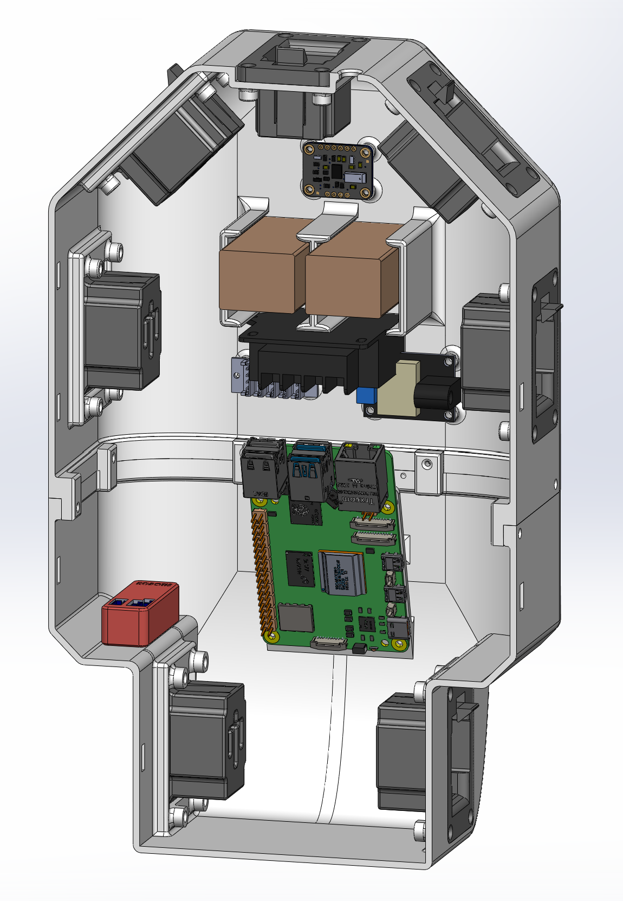

# Torso

## BOM
- XL330-M288-T x22 (ROBOTIS https://emanual.robotis.com/docs/en/dxl/x/xl330-m288/)
- XL330-M077-T x2 (ROBOTIS https://emanual.robotis.com/docs/en/dxl/x/xl330-m077/)
- Raspberry Pi 5a x1 (https://www.digikey.com/en/products/detail/raspberry-pi/SC1112/21658257)
- Raspberry Pi 5 active cooler x1 (https://www.sparkfun.com/raspberry-pi-active-cooler.html?src=raspberrypi)
- Buck converter x1 (https://a.co/d/5o0ji8z)
- Lipo batteries x2 (https://www.getfpv.com/batteries/mini-quad-batteries/lumenier-850mah-4s-75c-lipo-battery-xt-30.html)
- IMU x1 (https://www.adafruit.com/product/2472)
- U2D2 x1 (https://www.robotis.us/u2d2/?srsltid=AfmBOopnAfcYD4wZJd2mYGfl02LkN3lmzDXwg2oOkg-FG9G7V-jAIUyt)
- TTL Expansion Board x2 (https://www.robotis.us/3p-extension-pcb/?searchid=199934&search_query=6+port+)
- Baby Carrier x1 (https://a.co/d/6YLBBi4)
- XT30 Connector Female x1 (https://www.tme.com/us/en-us/details/xt30u-m/dc-power-connectors/amass/)
- SD card x1
- M3x8 screw x28
- M2x6 screw x24
- Female jumper wires x6

Screws for leader assembly (included in XL330 servo box):
- M2x6mm self tapping screw
- M2x8mm self tapping screw

# 3D printed parts
## Torso 
- [leader_mount.STL](./3D_print_parts/leader_mount.STL) x7
- [back_cover_lower.STL](./3D_print_parts/back_cover_lower.STL)
- [back_cover_upper.STL](./3D_print_parts/back_cover_upper.STL)
- [torso_lower.STL](./3D_print_parts/torso_lower.STL)
- [torso_upper.STL](./3D_print_parts/torso_upper.STL)
## G1 Limb Leaders 
- [G1_Arm_Leader_R_handle.STL](./3D_print_parts/G1_Arm_Leader_R_handle.STL) x2
- [G1_Arm_Leader_trigger.STL](./3D_print_parts/G1_Arm_Leader_trigger.STL) x2
- [G1_Leg_Leader_foot.STL](./3D_print_parts/G1_Leg_Leader_foot.STL) x2
- [G1_Leg_Leader_knee_jnt_limit.STL](./3D_print_parts/G1_Leg_Leader_knee_jnt_limit.STL) x2
- [G1_Leg_Leader_link_2.STL](./3D_print_parts/G1_Leg_Leader_link_2.STL) x2
- [G1_Leg_Leader_link_3.STL](./3D_print_parts/G1_Leg_Leader_link_3.STL) x2
- [G1_Leg_Leader_link_4.STL](./3D_print_parts/G1_Leg_Leader_link_4.STL) x2
- [G1_Arm_Leader_L_link_1.STL](./3D_print_parts/G1_Arm_Leader_L_link_1.STL)
- [G1_Arm_Leader_L_link_2.STL](./3D_print_parts/G1_Arm_Leader_L_link_2.STL)
- [G1_Arm_Leader_L_link_3.STL](./3D_print_parts/G1_Arm_Leader_L_link_3.STL)
- [G1_Arm_Leader_L_link_4.STL](./3D_print_parts/G1_Arm_Leader_L_link_4.STL)
- [G1_Arm_Leader_L_link_5.STL](./3D_print_parts/G1_Arm_Leader_L_link_5.STL)
- [G1_Arm_Leader_L_link_6.STL](./3D_print_parts/G1_Arm_Leader_L_link_6.STL)
- [G1_Arm_Leader_R_arm_link1.STL](./3D_print_parts/G1_Arm_Leader_R_arm_link1.STL)
- [G1_Arm_Leader_R_link_2.STL](./3D_print_parts/G1_Arm_Leader_R_link_2.STL)
- [G1_Arm_Leader_R_link_3.STL](./3D_print_parts/G1_Arm_Leader_R_link_3.STL)
- [G1_Arm_Leader_R_link_4.STL](./3D_print_parts/G1_Arm_Leader_R_link_4.STL)
- [G1_Arm_Leader_R_link_5.STL](./3D_print_parts/G1_Arm_Leader_R_link_5.STL)
- [G1_Arm_Leader_R_link_6.STL](./3D_print_parts/G1_Arm_Leader_R_link_6.STL)
- [G1_Leg_Leader_L_link1.STL](./3D_print_parts/G1_Leg_Leader_L_link1.STL)
- [G1_Leg_Leader_R_link1.STL](./3D_print_parts/G1_Leg_Leader_R_link1.STL)