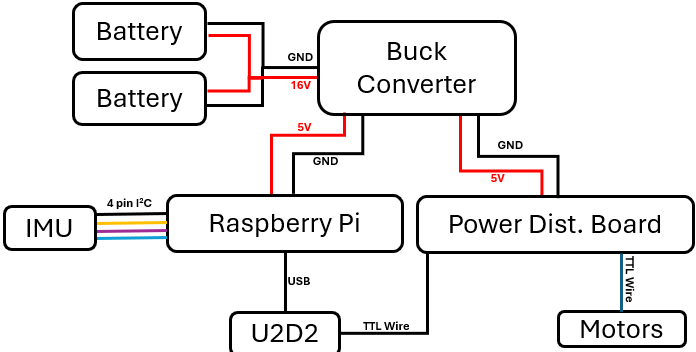

# Schematic

# BOM
| Item           | Quantity        | Unit Cost (USD)            | Cost          | Source          |  
| :------------- | :-------------: | :-------------:            | :-------------|   :-------------|
| XL330-M288-T                 | 22 |  26.29         | 578.38                   | [ROBOTIS](https://www.robotis.us/dynamixel-xl330-m288-t/)|
| XL330-M077-T                 | 2  |  26.29         | 52.58                    | [ROBOTIS](https://www.robotis.us/dynamixel-xl330-m077-t/)|
| FPX330-H101 4pcs Set         | 3  |  11.27         | 33.81                    | [ROBOTIS](https://www.robotis.us/fpx330-h101-4pcs-set/)|
| Raspberry Pi 5a              | 1  |  80            | 80                       | [Digikey](https://www.digikey.com/en/products/detail/raspberry-pi/SC1112/21658257)|
| Raspberry Pi 5 active cooler | 1  |  9.50          | 9.50                     | [Sparkfun](https://www.sparkfun.com/raspberry-pi-active-cooler.html?src=raspberrypi)|
| Buck converter               | 1  |  11.00         | 11.00                    | [Amazon](https://a.co/d/34K1G3W)|
| Lipo batteries               | 2  |  31.49         | 62.98                    | [getfpv](https://www.getfpv.com/batteries/mini-quad-batteries/lumenier-850mah-4s-75c-lipo-battery-xt-30.html)|
| IMU                          | 1  |  34.95         | 34.95                    | [Adafruit](https://www.adafruit.com/product/2472)|
| U2D2                         | 1  |  35.31         | 35.31                    | [ROBOTIS](https://www.robotis.us/u2d2/?srsltid=AfmBOopnAfcYD4wZJd2mYGfl02LkN3lmzDXwg2oOkg-FG9G7V-jAIUyt)|
| TTL Expansion Board          | 2  |  3.85          | 7.70                     | [ROBOTIS](https://www.robotis.us/3p-extension-pcb/?searchid=199934&search_query=6+port+)|
| Baby Carrier                 | 1  |  37.99         | 37.99                    | [Amazon](https://a.co/d/6YLBBi4)|
| XT30 Connector Female        | 1  |  8.99          | 8.99                     | [Amazon](https://a.co/d/beCXKoa)|
| SD card                      | 1  |  14.99         | 14.99                    | [Amazon](https://a.co/d/bTOPJQl)|
| M3x8 screw                   | 33 |  0.0545        | 1.80                     | [Mcmaster](https://www.mcmaster.com/91292A112/) |
| M2x8 screw                   | 4  |  0.0712        | 0.28                     | [Mcmaster](https://www.mcmaster.com/91292a832/) |
| M2x6 screw                   | 24 |  0.0878        | 2.11                     | [Mcmaster](https://www.mcmaster.com/91292a831/) |
| Female jumper wires          | 6  |  0.0582        | 0.46                     | [Amazon](https://a.co/d/gtiBsbT)|
| PLA Filament                 | 1.1kg  |  -         | 25.3                     | |
|                              |    |  **Total**     | 998.13                  | |
### Miscellaneous
- Power wires

# Torso
**3D Prints**
- [leader_mount.STL](./3D_print_parts/leader_mount.STL) `x7`
- [back_cover_clip.STL](./3D_print_parts/back_cover_clip.STL) `x2`
- [back_cover_lower.STL](./3D_print_parts/back_cover_lower.STL)
- [back_cover_upper.STL](./3D_print_parts/back_cover_upper.STL)
- [torso_lower.STL](./3D_print_parts/torso_lower.STL)
- [torso_upper.STL](./3D_print_parts/torso_upper.STL)

# G1 Limb Leaders
Screws and wires for leader assembly (included in XL330 servo box):
- M2x6mm self tapping screw
- M2x8mm self tapping screw
- TTL wires

**3D Prints**
- [G1_Arm_Leader_R_handle.STL](./3D_print_parts/G1_Arm_Leader_R_handle.STL) `x2`
- [G1_Arm_Leader_trigger.STL](./3D_print_parts/G1_Arm_Leader_trigger.STL) `x2`
- [G1_Leg_Leader_foot.STL](./3D_print_parts/G1_Leg_Leader_foot.STL) `x2`
- [G1_Leg_Leader_knee_jnt_limit.STL](./3D_print_parts/G1_Leg_Leader_knee_jnt_limit.STL) `x2`
- [G1_Leg_Leader_link_2.STL](./3D_print_parts/G1_Leg_Leader_link_2.STL) `x2`
- [G1_Leg_Leader_link_3.STL](./3D_print_parts/G1_Leg_Leader_link_3.STL) `x2`
- [G1_Leg_Leader_link_4.1.STL](./3D_print_parts/G1_Leg_Leader_link_4.1.STL) `x2`
- [G1_Leg_Leader_link_4.2.STL](./3D_print_parts/G1_Leg_Leader_link_4.2.STL) `x2`
- [G1_Leg_Leader_L_link1.STL](./3D_print_parts/G1_Leg_Leader_L_link1.STL)
- [G1_Leg_Leader_R_link1.STL](./3D_print_parts/G1_Leg_Leader_R_link1.STL)
- [G1_Arm_Leader_L_link_1.STL](./3D_print_parts/G1_Arm_Leader_L_link_1.STL)
- [G1_Arm_Leader_L_link_2.STL](./3D_print_parts/G1_Arm_Leader_L_link_2.STL)
- [G1_Arm_Leader_L_link_3.STL](./3D_print_parts/G1_Arm_Leader_L_link_3.STL)
- [G1_Arm_Leader_L_link_4.STL](./3D_print_parts/G1_Arm_Leader_L_link_4.STL)
- [G1_Arm_Leader_L_link_5.STL](./3D_print_parts/G1_Arm_Leader_L_link_5.STL)
- [G1_Arm_Leader_L_link_6.STL](./3D_print_parts/G1_Arm_Leader_L_link_6.STL)
- [G1_Arm_Leader_R_link_1.STL](./3D_print_parts/G1_Arm_Leader_R_link_1.STL)
- [G1_Arm_Leader_R_link_2.STL](./3D_print_parts/G1_Arm_Leader_R_link_2.STL)
- [G1_Arm_Leader_R_link_3.STL](./3D_print_parts/G1_Arm_Leader_R_link_3.STL)
- [G1_Arm_Leader_R_link_4.STL](./3D_print_parts/G1_Arm_Leader_R_link_4.STL)
- [G1_Arm_Leader_R_link_5.STL](./3D_print_parts/G1_Arm_Leader_R_link_5.STL)
- [G1_Arm_Leader_R_link_6.STL](./3D_print_parts/G1_Arm_Leader_R_link_6.STL)

## Monitor Stand Adapter
- [Monitor_stand_attachment.STL](./3D_print_parts/Monitor_stand_attachment.STL)
- [Monitor_stand_bracket.STL](./3D_print_parts/Monitor_stand_bracket.STL)
- [monitor_stand_lock.STL](./3D_print_parts/monitor_stand_lock.STL)