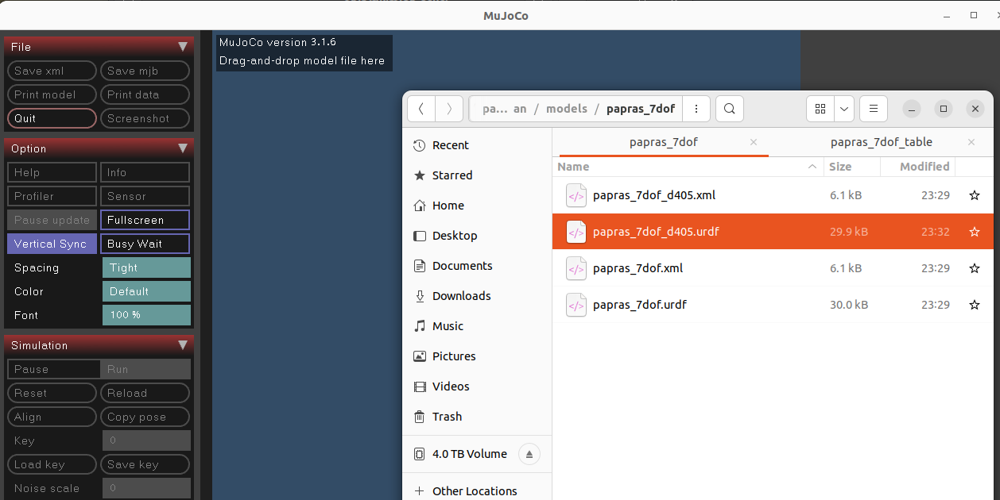
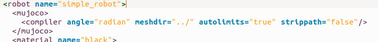
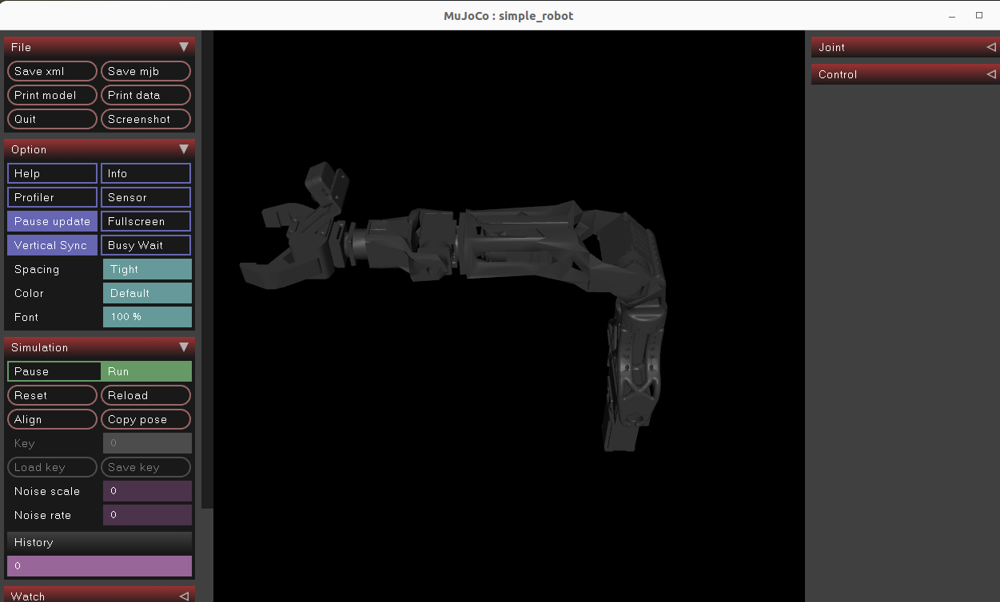

# How to convert URDF file into XML
- If you are considering conversion because of mujoco could not load urdf file, try to add tag in number 3, and try to load the URDF file again.
1. Run mujoco.viewer
    ```shell
    python -m mujoco.viewer
    ```
2. Drag and drop the URDF file into the viewer
    
3. You may need to add mujoco tag in the URDF file, for proper mesh import
    ```xml
      <mujoco>
        <compiler angle="radian" meshdir="../" autolimits="true" strippath="false" fusestatic="false"/>
      </mujoco>
    ```
    Add this tag to the start of the URDF file. 
    
4. After loading the URDF file, click on the "Save as XML" button to save the XML file. You will see `mjmodel.xml` in the same directory you ran the viewer.
    
5. I personally recommend to add following line `<include ... />` in XML file, for better visualization. This line adds the floor and sky to the scene.
    ```xml
    <mujoco model="some_model_name">
       <include file="../assets/scene/floor_sky.xml" />
       ...
    </mujoco>
    ```