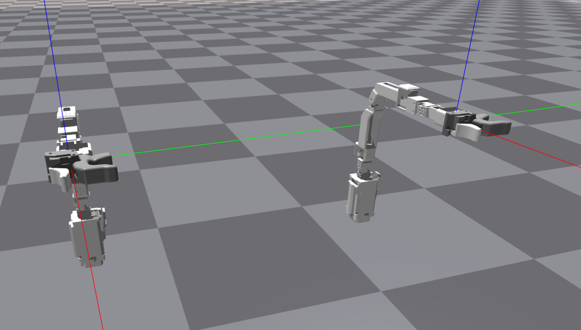
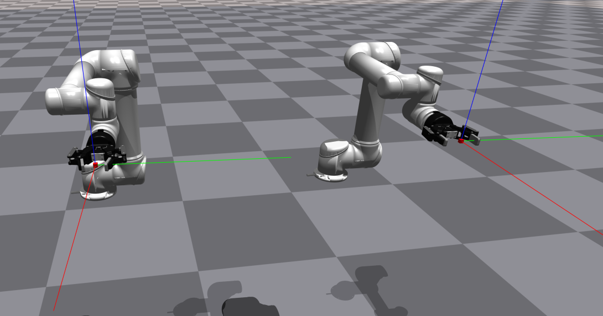
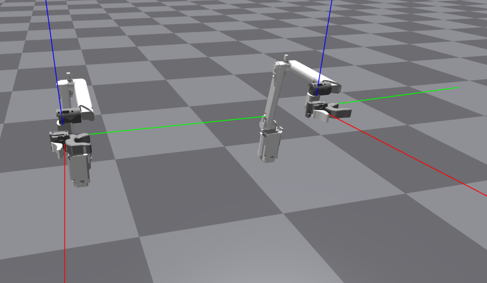

# How to setup a new robot
### 0. Prerequisites
- Make sure you have the robot's URDF file and meshes in the `models/` directory.
- If your robot has multiple limbs, also prepare a URDF file for each limb.
- Check your urdf file with `scripts/check_urdf_in_isaacgym.py` to see if there are any errors or missing meshes.
  - Otherwise, You can also use `scripts/check_urdf_in_mujoco.py` to check the URDF file for Mujoco.
###  1. Write configuration file
Create a new configuration file in the `configs/robot/` directory. 
The configuration file should be named `<robot_name>.yaml` where `robot_name` is the name of the robot. 
The configuration file should contain the following fields:

```yaml
mesh_dir: 'models/' # Default directory for meshes
robot_cfg:
  name: <robot_name>
  asset_cfg:
    urdf_path: 'models/<robot_name>/<robot_name>.urdf' # Path to the URDF file
    xml_path: 'models/<robot_name>/<robot_name>.xml' # If you have xml file, specify the path here or just use urdf file here as well
  ignore_collision_pairPinnochios: # List of collision pairs to ignore, use * for partial match
    - [".*link2", "world"]
    - ['.*gripper_link', '.*gripper_sub_link']
  control_dt: 0.008 # Control loop frequency - 125Hz for PAPRAS
  eef_type: 'parallel_gripper' # Type of end effector: 'hand', 'power_gripper', 'parallel_gripper'
  arm_dof: 7 # the number of joints in the arm
  hand_dof: 1 # the number of joints in the hand
  num_eefs: 2 # number of arms (end effectors) - 1 for single arm, 2 for dual arm
  max_joint_vel: 1.0 # Maximum joint velocity
  end_effector_link: ['robot1/end_effector_link', 'robot2/end_effector_link']
  # Specify the joint names you want to control, this order of joints will be used in general for everything in the code
  # name of the joints should match the names in the URDF file
  ctrl_joint_names: [ 'robot1/joint1', 'robot1/joint2', 'robot1/joint3', 'robot1/joint4', 'robot1/joint5', 'robot1/joint6','robot1/joint7','robot1/gripper',
                      'robot2/joint1', 'robot2/joint2', 'robot2/joint3', 'robot2/joint4', 'robot2/joint5', 'robot2/joint6','robot2/joint7','robot2/gripper' ]
  named_poses:
    #TODO: maybe read this info from srdf file, but conditionally. If not found, use this info
    init: [0.384, -1.057, 0.0, 0.485, 0.0, 1.125, 0.0, 0.0,
           -0.384, -1.057, 0.0, 0.485, 0.0, 1.125, 0.0, 0.0]
ik_cfg: # information for inverse kinematics. Use single arm model for each arm.
  # the number of arms in the urdf file, the name of the robot does not matter, but order matters.
  robot1:
    # chain of joint names from base to end effector
    joint_names: ['robot1/joint1', 'robot1/joint2', 'robot1/joint3', 'robot1/joint4', 'robot1/joint5', 'robot1/joint6', 'robot1/joint7']
    ee_link: robot1/end_effector_link
    dt: 0.05
    asset_dir: ${mesh_dir} # Directory for assets
    urdf_path: 'models/papras_7dof/papras_7dof.urdf'
    ik_damping: 0.075
    eps: 1e-3
    base_link: robot1/link1 # base_link in the original urdf file,not the base_link in the ik model
  robot2:
    joint_names: ['robot1/joint1', 'robot1/joint2', 'robot1/joint3', 'robot1/joint4', 'robot1/joint5', 'robot1/joint6', 'robot1/joint7']
    ee_link: robot1/end_effector_link
    dt: 0.05
    asset_dir: ${mesh_dir} # Directory for assets
    urdf_path: 'models/papras_7dof/papras_7dof.urdf'
    ik_damping: 0.075
    eps: 1e-3
    base_link: robot2/link1 # base_link in the original urdf file,not the base_link in the ik model
```

# URDF file
After you get the URDF file, make sure the `filename` for meshes are set to 'assets/~~.stl', and the meshes are in the `models/assets` directory.
Many of the code in this repository use `mesh_dir` as a prefix for the mesh file path.

#### About End Effector Coordinate
- It would be nice to have some convention for the end effector coordinate, for better IK-FK mapping.
- For now, I just manually changed the end effector coordinate in the URDF file, to have the same coordinate for all the robots & gello devices.
- Papras:
  
- UR5:
  
- Open Manipulator Y
  